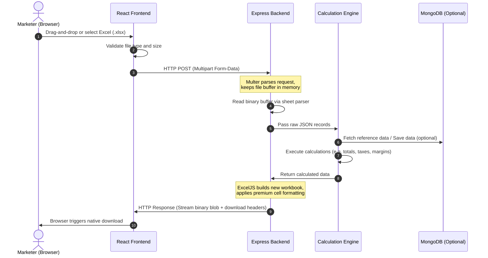

# Full-Stack & System Design Guide: Processing Excel Sheets in React & Node.js

Welcome! As your **Full-Stack and System Design Teacher**, I will walk you through the end-to-end architecture and implementation details for handling Excel spreadsheets. 

We will design a system that takes an Excel file (`.xlsx`), parses its content, runs custom calculations, generates a beautifully formatted Excel report on the fly, and sends it back to the client for immediate download.

---

## 1. System Design & Architecture Flow

Handling files requires a solid design to ensure memory efficiency, security, and a smooth user experience. Here is the architecture of our Excel processing pipeline:



---

## 2. Choosing the Right Libraries (The Tech Stack)

To build this in your React + Node.js workspace, we'll use industry-standard packages:

### Backend Stack
1. **`multer`**: Handles `multipart/form-data` uploads. We'll use memory storage to keep uploads stateless, which is ideal for serverless or containerized environments.
2. **`xlsx` (SheetJS)**: Best for fast parsing of Excel buffers into JSON objects.
3. **`exceljs`**: The gold standard for generating output files. Unlike basic libraries, it supports advanced formatting (fonts, borders, cell backgrounds, column auto-widths, and formulas).

### Frontend Stack
1. **React State & Form Elements**: For file handling.
2. **`axios`**: For sending the file and receiving the binary stream response correctly using the `responseType: 'blob'` configuration.

---

## 3. Step-by-Step Implementation Blueprint

Here is the code structure to implement this in your project.

### Step A: React Frontend Ingestion & Download
We use native React inputs to select the file, `FormData` to package it, and Axios to fetch the resulting file back. 

> [!IMPORTANT]
> When requesting an Excel file back from an API, you **MUST** set `responseType: 'blob'` in your Axios request. Otherwise, Axios will parse the binary sheet as string data, corrupting the downloaded file.

```jsx
import React, { useState } from 'react';
import axios from 'axios';

export default function ExcelProcessor() {
  const [file, setFile] = useState(null);
  const [loading, setLoading] = useState(false);
  const [status, setStatus] = useState('');

  const handleFileChange = (e) => {
    setFile(e.target.files[0]);
  };

  const handleUploadAndProcess = async (e) => {
    e.preventDefault();
    if (!file) {
      setStatus('Please select an Excel file first.');
      return;
    }

    const formData = new FormData();
    formData.append('file', file);

    setLoading(true);
    setStatus('Uploading and calculating...');

    try {
      // Post the file and expect a binary blob back
      const response = await axios.post('/api/excel/process', formData, {
        headers: {
          'Content-Type': 'multipart/form-data',
        },
        responseType: 'blob', // Critical for binary files
      });

      setStatus('Processing complete! Downloading your report...');

      // 1. Create a URL pointing to the binary blob
      const blob = new Blob([response.data], { 
        type: 'application/vnd.openxmlformats-officedocument.spreadsheetml.sheet' 
      });
      const downloadUrl = window.URL.createObjectURL(blob);

      // 2. Programmatically create an anchor tag and click it to trigger download
      const link = document.createElement('a');
      link.href = downloadUrl;
      link.setAttribute('download', `calculated_report_${Date.now()}.xlsx`);
      document.body.appendChild(link);
      link.click();
      
      // 3. Clean up the URL object
      link.remove();
      window.URL.revokeObjectURL(downloadUrl);
      
    } catch (error) {
      console.error(error);
      setStatus('An error occurred during sheet processing.');
    } finally {
      setLoading(false);
    }
  };

  return (
    <div className="p-8 max-w-lg mx-auto bg-slate-900 text-white rounded-xl shadow-lg border border-slate-800">
      <h2 className="text-2xl font-bold mb-4 bg-gradient-to-r from-teal-400 to-cyan-500 bg-clip-text text-transparent">
        Excel Intelligence Pipeline
      </h2>
      <p className="text-slate-400 text-sm mb-6">
        Upload a shopper or billing spreadsheet. The system will auto-calculate taxes, customer tiers, and export a styled report.
      </p>

      <form onSubmit={handleUploadAndProcess} className="space-y-4">
        <div className="border-2 border-dashed border-slate-700 rounded-lg p-6 hover:border-teal-500 transition-colors text-center cursor-pointer">
          <input 
            type="file" 
            accept=".xlsx, .xls" 
            onChange={handleFileChange}
            className="hidden"
            id="excel-file-input"
          />
          <label htmlFor="excel-file-input" className="cursor-pointer block space-y-2">
            <span className="text-teal-400 font-semibold block">
              {file ? file.name : 'Select Excel Document'}
            </span>
            <span className="text-xs text-slate-500 block">Supports .xlsx and .xls formats</span>
          </label>
        </div>

        <button
          type="submit"
          disabled={loading}
          className="w-full py-3 bg-gradient-to-r from-teal-500 to-cyan-600 hover:from-teal-400 hover:to-cyan-500 text-slate-950 font-bold rounded-lg transition-all duration-200 disabled:opacity-50"
        >
          {loading ? 'Processing Spreadsheet...' : 'Analyze & Generate Output'}
        </button>
      </form>

      {status && (
        <div className="mt-4 p-3 bg-slate-800 rounded border border-slate-700 text-sm text-teal-300">
          {status}
        </div>
      )}
    </div>
  );
}
```

---

### Step B: Backend Routing & Excel Parsing (Node.js/Express)
Now, let's create the Express routes. We use `xlsx` (SheetJS) to quickly turn the spreadsheet rows into JSON array structure in memory.

```javascript
// routes/excelRoutes.js
const express = require('express');
const multer = require('multer');
const xlsx = require('xlsx');
const { processExcelCalculation } = require('../controllers/excelController');

const router = express.Router();

// Memory-based multer to keep operations stateless
const upload = multer({
  storage: multer.memoryStorage(),
  limits: { fileSize: 10 * 1024 * 1024 } // 10MB limit
});

/**
 * Helper middleware or function to convert xlsx buffer to JSON
 */
const parseExcelBufferToJSON = (buffer) => {
  // Read from the memory buffer
  const workbook = xlsx.read(buffer, { type: 'buffer' });
  
  // Select the first sheet
  const firstSheetName = workbook.SheetNames[0];
  const worksheet = workbook.Sheets[firstSheetName];
  
  // Convert sheet to array of objects
  // defval: null maps empty cells to null instead of omitting them
  const rows = xlsx.utils.sheet_to_json(worksheet, { defval: null });
  return rows;
};

// Route
router.post('/process', upload.single('file'), async (req, res, next) => {
  try {
    if (!req.file) {
      return res.status(400).json({ success: false, message: 'No file uploaded.' });
    }

    // 1. Convert Excel buffer to JSON data structure
    const rawRecords = parseExcelBufferToJSON(req.file.buffer);

    // 2. Delegate calculations and formatting output
    await processExcelCalculation(rawRecords, res);

  } catch (error) {
    next(error);
  }
});

module.exports = router;
```

---

### Step C: Calculation Engine & Styled Excel Output (`exceljs`)
This is the core business logic. We calculate tax rates and customer rankings, then generate a highly-styled spreadsheet response.

```javascript
// controllers/excelController.js
const ExcelJS = require('exceljs');

const processExcelCalculation = async (rawRecords, res) => {
  // 1. Perform Calculations / Logic
  // Let's assume input has: { Email, Name, Subtotal }
  // We want to calculate: Tax (18%), GrandTotal, and LoyaltyTier
  const calculatedRecords = rawRecords.map((row) => {
    const subtotal = parseFloat(row.Subtotal) || 0;
    const tax = parseFloat((subtotal * 0.18).toFixed(2));
    const grandTotal = parseFloat((subtotal + tax).toFixed(2));
    
    let loyaltyTier = 'Bronze';
    if (subtotal > 10000) loyaltyTier = 'Gold';
    else if (subtotal > 5000) loyaltyTier = 'Silver';

    return {
      Email: row.Email || 'N/A',
      Name: row.Name || 'Guest User',
      Subtotal: subtotal,
      Tax: tax,
      GrandTotal: grandTotal,
      LoyaltyTier: loyaltyTier
    };
  });

  // 2. Construct the Response Workbook via ExcelJS
  const workbook = new ExcelJS.Workbook();
  const worksheet = workbook.addWorksheet('Revenue Analytics');

  // Define Columns (Headers & widths)
  worksheet.columns = [
    { header: 'Email Address', key: 'Email', width: 30 },
    { header: 'Customer Name', key: 'Name', width: 20 },
    { header: 'Subtotal (INR)', key: 'Subtotal', width: 15 },
    { header: 'Tax (18% INR)', key: 'Tax', width: 15 },
    { header: 'Grand Total (INR)', key: 'GrandTotal', width: 18 },
    { header: 'Loyalty Tier', key: 'LoyaltyTier', width: 15 }
  ];

  // 3. Style the Header Row (Premium Aesthetics)
  const headerRow = worksheet.getRow(1);
  headerRow.height = 25;
  headerRow.eachCell((cell) => {
    // Elegant Dark Theme for Headers
    cell.fill = {
      type: 'pattern',
      pattern: 'solid',
      fgColor: { argb: 'FF0F172A' } // Tailwind slate-900 equivalent
    };
    cell.font = {
      name: 'Segoe UI',
      bold: true,
      color: { argb: 'FFFFFFFF' },
      size: 11
    };
    cell.alignment = { vertical: 'middle', horizontal: 'center' };
  });

  // 4. Populate rows & apply micro-formatting per data type
  calculatedRecords.forEach((record) => {
    const row = worksheet.addRow(record);
    
    // Style numeric currency cells
    row.getCell('Subtotal').numFmt = '"₹"#,##0.00';
    row.getCell('Tax').numFmt = '"₹"#,##0.00';
    row.getCell('GrandTotal').numFmt = '"₹"#,##0.00';

    // Conditional styling based on values (Tiers)
    const tierCell = row.getCell('LoyaltyTier');
    if (record.LoyaltyTier === 'Gold') {
      tierCell.font = { bold: true, color: { argb: 'FFCA8A04' } }; // Gold color text
      tierCell.fill = { type: 'pattern', pattern: 'solid', fgColor: { argb: 'FEF9C3' } }; // Light yellow bg
    } else if (record.LoyaltyTier === 'Silver') {
      tierCell.font = { bold: true, color: { argb: 'FF475569' } }; // Slate color text
      tierCell.fill = { type: 'pattern', pattern: 'solid', fgColor: { argb: 'F1F5F9' } }; // Light gray bg
    }
  });

  // 5. Add a Summary/Total Row at the bottom
  const totalRowIndex = calculatedRecords.length + 2; // Leave one blank row
  worksheet.getCell(`A${totalRowIndex}`).value = 'Total Account Analytics';
  worksheet.getCell(`A${totalRowIndex}`).font = { bold: true };
  
  // Use native Excel formulas for totals so they are dynamic if edited!
  worksheet.getCell(`C${totalRowIndex}`).value = { formula: `SUM(C2:C${calculatedRecords.length + 1})` };
  worksheet.getCell(`D${totalRowIndex}`).value = { formula: `SUM(D2:D${calculatedRecords.length + 1})` };
  worksheet.getCell(`E${totalRowIndex}`).value = { formula: `SUM(E2:E${calculatedRecords.length + 1})` };

  worksheet.getRow(totalRowIndex).font = { bold: true };
  worksheet.getRow(totalRowIndex).getCell('C').numFmt = '"₹"#,##0.00';
  worksheet.getRow(totalRowIndex).getCell('D').numFmt = '"₹"#,##0.00';
  worksheet.getRow(totalRowIndex).getCell('E').numFmt = '"₹"#,##0.00';

  // Apply neat thin borders to rows for professional layout
  worksheet.eachRow((row) => {
    row.eachCell((cell) => {
      cell.border = {
        top: { style: 'thin', color: { argb: 'FFE2E8F0' } },
        bottom: { style: 'thin', color: { argb: 'FFE2E8F0' } }
      };
    });
  });

  // 6. Set HTTP Headers and Stream File to Response
  res.setHeader(
    'Content-Type',
    'application/vnd.openxmlformats-officedocument.spreadsheetml.sheet'
  );
  res.setHeader(
    'Content-Disposition',
    'attachment; filename=' + `report_${Date.now()}.xlsx`
  );

  // Write workbook data directly into Express response object stream
  await workbook.xlsx.write(res);
  res.end();
};

module.exports = { processExcelCalculation };
```

---

## 4. System Design Trade-Offs & Scaling (Enterprise Ready)

As you scale this feature for real users, watch out for these engineering pitfalls:

### A. Memory Constraints vs. Disk Streaming
*   **In-Memory (`multer.memoryStorage()`)**: Fast, simple, and stateless. Ideal for files under 20–50MB. However, since the server holds the entire binary buffer in RAM, concurrently uploading several large spreadsheets could lead to an **Out-Of-Memory (OOM) crash** on your Node.js instance.
*   **Disk Storage (`multer.diskStorage()` or direct S3 upload)**: For large files (100MB+ or >50,000 rows), stream the file directly to disk or an object storage service like AWS S3. Perform the parsing line-by-line using streaming libraries to prevent RAM spike.

### B. CPU Blocking vs. Background Workers
*   JSON calculations on 50,000+ objects can block Node's single event loop thread, causing API lag or downtime for other users.
*   **Solution**: For heavy calculations, immediately save the file metadata to MongoDB, return a `202 Accepted` status with a `jobId`, and process the data asynchronously in a background worker (e.g., using **BullMQ** or **Celery** with **Redis**). Notify the user via WebSockets or polling when their styled Excel is ready for download.

### C. Security: Preventing Zip Bomb Attacks
*   An Excel file (`.xlsx`) is essentially an XML folder compressed into a ZIP. A malicious actor can upload a small 5KB file that decompresses into 50GB of raw text (known as a **ZIP Bomb**).
*   **Solution**: Always configure strict payload limits in Multer (`fileSize: 10 * 1024 * 1024`) and limit the memory allowance. If files exceed this, drop them.

---

## 5. Complementary Libraries for Production Spreadsheet Pipelines

To transform a basic proof-of-concept into a robust, enterprise-grade data platform, you will need tools for data validation, interactive UI previews, high-performance computing, and background workers. Here is the ultimate toolbox organized by service tier:

### A. Data Validation & Formatting (Backend & Frontend)
Excel spreadsheets are notorious for human error (missing fields, letters in numeric fields, malformed emails).
*   **`zod`** / **`yup`**: Use these schemas on the backend to validate parsed objects. If a row fails the schema, push it to an error array.
    *   *Why*: Let's you return a precise error report at the end of the upload (e.g., *"Row 14: Invalid Email address format"*).
*   **`read-excel-file`**: A simple, lightweight browser-based library specifically built to map Excel columns directly into formatted JSON array structures using a strict template schema. Perfect if you want to validate file structures before sending them over the network.

### B. Interactive UI Spreadsheet Components (Frontend)
Sometimes, users want to review or manually modify spreadsheet data *inside* your React CRM before saving it to the database or running backend formulas.
*   **`luckysheet`** / **`univer`**: Open-source, web-based spreadsheet engines that look and perform exactly like Google Sheets or Microsoft Excel. You can load sheets directly into a React component and allow real-time browser editing.
*   **`react-spreadsheet`**: A lighter, modern React component for rendering simple grid grids.

### C. Advanced Calculations & Data Science (Backend)
If your computations go beyond basic sums and margins:
*   **`danfojs`**: Built on top of TensorFlow.js, this is the Node.js/Javascript equivalent of Python's **Pandas** library. It provides high-performance data structures like `DataFrames` to easily filter, group, join, calculate statistical variables, and run pivot tables.
*   **`mathjs`**: An extensive math library for Node.js. It features a flexible expression parser and supports matrices, complex numbers, and units, ensuring highly accurate floating-point calculations (avoiding JavaScript's `0.1 + 0.2 === 0.30000000000000004` rounding issues).

### D. Asynchronous Job Processing (Scale Tier)
*   **`bullmq`** / **`bull`**: The fastest, most reliable Redis-backed message queue for Node.js. It allows you to process spreadsheets as background jobs, manage job progression, handle retry logic, and throttle concurrent tasks.
*   **`fastq`**: A lightweight, zero-dependency, in-memory queue module if you want simple concurrency limits without setting up Redis.

### E. Template-Driven Document Generators
*   **`carbone`**: Instead of writing manual Excel cells via code (which can get tedious for highly complex designs), you create a template file in actual MS Excel (`.xlsx`) with formatting, fonts, and charts, placing variables like `{d.customerName}` inside cells. Carbone will inject your JSON data into the template and output a compiled, perfectly formatted Excel file.

